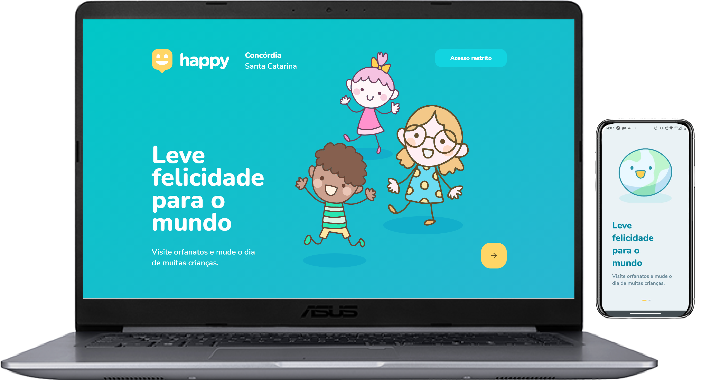

<h1 align="center">
    
</h1>

<p align="center">
  <a href="#-tecnologias">Tecnologias</a>&nbsp;&nbsp;&nbsp;|&nbsp;&nbsp;&nbsp;
  <a href="#-projeto">Projeto</a>&nbsp;&nbsp;&nbsp;|&nbsp;&nbsp;&nbsp;
  <a href="#-layout">Layout</a>
</p>

<p align="center">
 

  
</p>

<br>

<p align="center">
  
</p>

## 🚀 Tecnologias

Esse projeto foi desenvolvido com as seguintes tecnologias:

- [Node.js](https://nodejs.org/en/)
- [React](https://reactjs.org)
- [React Native](https://facebook.github.io/react-native/)
- [Expo](https://expo.io/)
- [TypeScript](https://www.typescriptlang.org/)

## 💻 Projeto

O Happy é uma aplicação que conecta pessoas à casas de acolhimento institucional para fazer o dia de muitas crianças mais feliz 💜

## 🔖 Layout

Nos links abaixo você encontra o layout do projeto web e também do mobile. Lembrando que você precisa ter uma conta no [Figma](http://figma.com/) para acessá-lo.

- [Layout Web](https://www.figma.com/file/mDEbnoojksG4w8sOxmudh3/Happy-Web)
- [Layout Mobile](https://www.figma.com/file/X27FfVxAgy9f5IFa7ONlph/Happy-Mobile)


## 📱💻 Instruções

```
## 1. Clonar repositório
git clone https://github.com/DanielSchwingel/happy.git

## 2. Entrar na pasta
cd happy

## 3. Instalar as dependências
cd backend && npm install
cd web && npm install
cd mobile && npm install

## 4. Colocar suas configurações do banco de dados
cd backend 
ormconfig.json (Mudar as configurações)

## 4. Rodar a aplicação
cd backend && npp run dev (http://localhost:3333)
cd web && npm start (http://localhost:3000)
cd mobile && expo start (Escanear o QR CODE com o aplicativo do Expo)
```

---

Feito com 💜
